# m-MNCH Care — App Sitemap

**For use in the tutorial document (Midwife User Manual)**  
This sitemap shows all main screens and navigation flows for both Android and web.

---

## Visual Sitemap (Mermaid)

```mermaid
flowchart TD
    subgraph Entry
        index[index.html<br/>Landing]
        login[login.html<br/>Login]
        reg[registration.html<br/>Registration]
        consent[provider-consent.html<br/>Provider Consent]
    end

    subgraph Home [" "]
        home[home.html<br/>Home]
    end

    subgraph Registration [" "]
        regSuccess[registration-success.html]
    end

    subgraph PatientList ["Patient Selection"]
        list[list.html<br/>Patient List]
        patientEnhanced[patient-enhanced.html<br/>Enhanced Patient View]
        editPatient[edit-patient.html<br/>Edit Patient]
    end

    subgraph CareHub ["Patient Care Hub"]
        hub[patient-care-hub.html<br/>Care Hub]
        hubLCG[patient-care-hub-lcg.html<br/>LCG Care Hub]
    end

    subgraph Antenatal ["Antenatal Care"]
        anc[antenatal-care.html]
        ancForm[antenatal-form.html<br/>ANC Form]
        ancReport[antenatal-report.html<br/>ANC Report]
        ancTests[antenatal-tests.html]
        ancTestsForm[antenatal-tests-form.html]
        ancAppt[antenatal-appointments.html]
        ancEdu[antenatal-education.html]
        eduPH[education-pregnancy-health.html]
        eduBF[education-breastfeeding.html]
        eduNut[education-nutrition.html]
        eduSC[education-self-care.html]
    end

    subgraph Labour ["Labour Care"]
        labourEntry[labour-care-entry.html]
        labourSetup[labour-care-setup.html]
        labourCare[labour-care.html]
        labourMonitor[labour-monitoring.html]
        labourProtocols[labour-protocols.html]
        labourEmerg[labour-emergencies.html]
        otherOutcome[other-outcome.html]
        transfer[transfer.html]
    end

    subgraph Newborn ["Newborn Care"]
        inc[immediate-newborn-care.html]
        incForm[immediate-newborn-care-form.html]
        newbornPage[newborn-care-page.html]
        newbornReport[newborn-report.html]
    end

    subgraph Postpartum ["Postpartum Care"]
        pp[postpartum-care.html]
        ppForm[postpartum-form.html]
        ppReport[postpartum-report.html]
        ppHistory[postpartum-history.html]
    end

    subgraph Baby ["Baby Care"]
        babyCare[baby-care.html]
        baby[baby.html]
        babyReport[baby-report.html]
    end

    subgraph Reports ["Reports & Summary"]
        summary[summary.html<br/>Care Summary]
        summaryView[summary-view.html]
        overallReport[overall-patient-report.html]
        patientInfoReport[patient-info-report.html]
        vaccine[vaccine-schedule.html]
    end

    subgraph Other ["Other Modules"]
        dashboard[dashboard.html]
        townshipReport[township-report.html]
        admin[admin.html]
        cme[cme-learning.html]
        cmeMandatory[cme-mandatory.html]
        cmeOptional[cme-optional.html]
        leaderboard[leaderboard.html]
        settings[settings.html]
        feedback[feedback-form.html]
    end

    subgraph Legal [" "]
        privacy[privacy-policy.html]
        patientConsent[patient-consent.html]
    end

    index --> login
    login --> home
    login --> reg
    login --> consent
    consent --> home
    reg --> regSuccess
    regSuccess --> login

    home --> list
    home --> patientEnhanced
    home --> dashboard
    home --> townshipReport
    home --> admin
    home --> cme
    home --> leaderboard
    home --> settings

    list --> hub
    list --> hubLCG
    list --> patientEnhanced
    list --> editPatient
    patientEnhanced --> hub

    hub --> anc
    hub --> summary
    hub --> pp
    hub --> vaccine
    hub --> inc
    hub --> overallReport
    hub --> labourEntry
    hub --> labourSetup
    hub --> list

    anc --> ancForm
    anc --> ancReport
    anc --> ancTests
    anc --> ancEdu
    ancForm --> ancEdu
    ancForm --> transfer
    ancForm --> ancReport
    ancEdu --> eduPH
    ancEdu --> eduBF
    ancEdu --> eduNut
    ancEdu --> eduSC
    eduPH --> ancEdu
    eduBF --> ancEdu
    eduNut --> ancEdu
    eduSC --> ancEdu
    ancTests --> ancTestsForm
    ancReport --> anc

    labourEntry --> labourSetup
    labourSetup --> labourCare
    labourCare --> labourMonitor
    labourCare --> labourProtocols
    labourCare --> labourEmerg
    labourCare --> otherOutcome
    labourCare --> transfer
    transfer --> summary
    transfer --> labourEntry

    inc --> incForm
    inc --> newbornPage
    inc --> newbornReport
    inc --> hub
    incForm --> inc
    newbornPage --> inc

    pp --> ppForm
    pp --> ppReport
    ppForm --> pp

    hub --> babyCare
    babyCare --> baby
    babyCare --> summaryView

    summary --> summaryView
    summary --> list
    summary --> transfer
```

---

## Hierarchical Outline (for Tutorial)

### 1. Entry & Auth

| Screen | File | From | To |
|--------|------|------|-----|
| Landing | `index.html` | — | `login.html` |
| Login | `login.html` | `index.html` | `home.html`, `registration.html`, `provider-consent.html` |
| Registration | `registration.html` | `login.html` | `registration-success.html` |
| Provider Consent | `provider-consent.html` | `login.html` | `home.html` |
| Registration Success | `registration-success.html` | `registration.html` | `login.html` |

### 2. Home & Main Modules

| Screen | File | From | To |
|--------|------|------|-----|
| Home | `home.html` | `login.html` | `list.html`, `patient-enhanced.html`, `dashboard.html`, `township-report.html`, `admin.html`, `cme-learning.html`, `leaderboard.html`, `settings.html` |

### 3. Patient Selection

| Screen | File | From | To |
|--------|------|------|-----|
| Patient List | `list.html` | `home.html` | `patient-care-hub.html`, `patient-care-hub-lcg.html`, `patient-enhanced.html`, `edit-patient.html` |
| Enhanced Patient View | `patient-enhanced.html` | `home.html`, `list.html` | `patient-care-hub.html` |
| Edit Patient | `edit-patient.html` | `list.html` | `list.html` |

### 4. Patient Care Hub (Central Hub)

| Screen | File | From | To |
|--------|------|------|-----|
| Patient Care Hub | `patient-care-hub.html` | `list.html`, `antenatal-care.html`, `postpartum-care.html`, `immediate-newborn-care.html`, `summary-view.html` | `antenatal-care.html`, `summary.html`, `postpartum-care.html`, `vaccine-schedule.html`, `immediate-newborn-care.html`, `overall-patient-report.html`, `labour-care-entry.html`, `labour-care-setup.html`, `list.html` |
| LCG Care Hub | `patient-care-hub-lcg.html` | `list.html`, `immediate-newborn-care.html` | `labour-care-entry.html`, `labour-care-setup.html`, `immediate-newborn-care.html`, `list.html` |

### 5. Antenatal Care

| Screen | File | From | To |
|--------|------|------|-----|
| Antenatal Care | `antenatal-care.html` | `patient-care-hub.html` | `antenatal-form.html`, `antenatal-report.html`, `antenatal-tests.html`, `antenatal-education.html` |
| ANC Form | `antenatal-form.html` | `antenatal-care.html` | `antenatal-education.html`, `transfer.html`, `antenatal-report.html` |
| ANC Report | `antenatal-report.html` | `antenatal-care.html`, `antenatal-form.html` | `antenatal-care.html`, `home.html` |
| Antenatal Tests | `antenatal-tests.html` | `antenatal-care.html` | `antenatal-tests-form.html` |
| ANC Tests Form | `antenatal-tests-form.html` | `antenatal-tests.html` | `antenatal-tests.html` |
| Antenatal Education | `antenatal-education.html` | `antenatal-care.html`, `antenatal-form.html` | `antenatal-care.html`, `education-pregnancy-health.html`, `education-breastfeeding.html`, `education-nutrition.html`, `education-self-care.html` |
| Education: Pregnancy Health | `education-pregnancy-health.html` | `antenatal-education.html` | `antenatal-education.html` |
| Education: Breastfeeding | `education-breastfeeding.html` | `antenatal-education.html` | `antenatal-education.html` |
| Education: Nutrition | `education-nutrition.html` | `antenatal-education.html` | `antenatal-education.html` |
| Education: Self-Care | `education-self-care.html` | `antenatal-education.html` | `antenatal-education.html` |

### 6. Labour Care

| Screen | File | From | To |
|--------|------|------|-----|
| Labour Care Entry | `labour-care-entry.html` | `patient-care-hub.html`, `transfer.html` | `labour-care-setup.html`, `list.html` |
| Labour Care Setup | `labour-care-setup.html` | `patient-care-hub.html`, `labour-care-entry.html` | `labour-care.html` |
| Labour Care | `labour-care.html` | `labour-care-setup.html` | `labour-monitoring.html`, `labour-protocols.html`, `labour-emergencies.html`, `other-outcome.html`, `transfer.html` |
| Labour Monitoring | `labour-monitoring.html` | `labour-care.html` | — |
| Labour Protocols | `labour-protocols.html` | `labour-care.html` | — |
| Labour Emergencies | `labour-emergencies.html` | `labour-care.html` | — |
| Other Outcome | `other-outcome.html` | `labour-care.html` | — |
| Transfer | `transfer.html` | `antenatal-form.html`, `labour-care.html` | `patient-care-hub.html`, `labour-care-entry.html`, `summary.html`, `list.html` |

### 7. Immediate Newborn Care

| Screen | File | From | To |
|--------|------|------|-----|
| Immediate Newborn Care | `immediate-newborn-care.html` | `patient-care-hub.html`, `patient-care-hub-lcg.html` | `immediate-newborn-care-form.html`, `newborn-care-page.html`, `newborn-report.html`, `patient-care-hub.html` |
| INC Form | `immediate-newborn-care-form.html` | `immediate-newborn-care.html` | `immediate-newborn-care.html` |
| Newborn Care Page | `newborn-care-page.html` | `immediate-newborn-care.html` | `immediate-newborn-care.html` |
| Newborn Report | `newborn-report.html` | `immediate-newborn-care.html` | — |

### 8. Postpartum Care

| Screen | File | From | To |
|--------|------|------|-----|
| Postpartum Care | `postpartum-care.html` | `patient-care-hub.html` | `postpartum-form.html`, `postpartum-report.html` |
| Postpartum Form | `postpartum-form.html` | `postpartum-care.html` | `postpartum-care.html` |
| Postpartum Report | `postpartum-report.html` | `postpartum-care.html` | `postpartum-care.html`, `home.html` |

### 9. Baby Care

| Screen | File | From | To |
|--------|------|------|-----|
| Baby Care | `baby-care.html` | `patient-care-hub.html` | `baby.html`, `summary-view.html` |
| Baby | `baby.html` | `baby-care.html` | — |
| Baby Report | `baby-report.html` | — | — |

### 10. Reports & Summary

| Screen | File | From | To |
|--------|------|------|-----|
| Care Summary | `summary.html` | `patient-care-hub.html` | `summary-view.html`, `list.html`, `transfer.html` |
| Summary View | `summary-view.html` | `summary.html`, `labour-care-entry.html`, `baby-care.html` | `patient-care-hub.html` |
| Overall Patient Report | `overall-patient-report.html` | `patient-care-hub.html` | — |
| Patient Info Report | `patient-info-report.html` | — | — |
| Vaccine Schedule | `vaccine-schedule.html` | `patient-care-hub.html` | — |

### 11. Other Modules

| Screen | File | From | To |
|--------|------|------|-----|
| Dashboard | `dashboard.html` | `home.html` | `login.html` |
| Township Report | `township-report.html` | `home.html` | — |
| Admin | `admin.html` | `home.html` | — |
| CME Learning | `cme-learning.html` | `home.html` | `cme-mandatory.html`, `cme-optional.html` |
| Leaderboard | `leaderboard.html` | `home.html` | — |
| Settings | `settings.html` | `home.html` | — |
| Feedback | `feedback-form.html` | — | — |

### 12. Legal & Utility

| Screen | File | From | To |
|--------|------|------|-----|
| Privacy Policy | `privacy-policy.html` | Various (footer links) | — |
| Patient Consent | `patient-consent.html` | — | — |

---

## Main User Journeys (for Tutorial)

1. **Registration & Login:** `index` → `login` → `provider-consent` → `home`
2. **Select Patient:** `home` → `list` → `patient-care-hub`
3. **Antenatal Flow:** `patient-care-hub` → `antenatal-care` → `antenatal-form` → `antenatal-report`
4. **Antenatal Education:** `antenatal-care` or `antenatal-form` → `antenatal-education` → education cards
5. **Labour Flow:** `patient-care-hub` → `labour-care-entry` → `labour-care-setup` → `labour-care` → `transfer` or `summary`
6. **Newborn Flow:** `patient-care-hub` → `immediate-newborn-care` → forms/reports
7. **Postpartum Flow:** `patient-care-hub` → `postpartum-care` → `postpartum-form` / `postpartum-report`

---

## Notes

- **Web vs Android:** Same HTML files serve both. Web deployment uses project root; Android assets are synced from the project root into `android/app/src/main/assets/public`.
- **Dynamic routes:** Most care screens use `?patient=<id>` or `?patient=<id>&edit=true` query params.
- **Auth guard:** Unauthenticated users are redirected to `login.html` from most pages.
