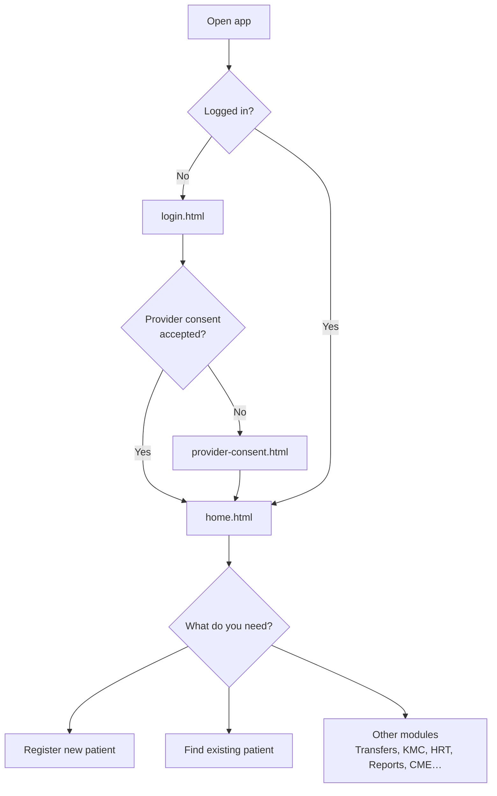
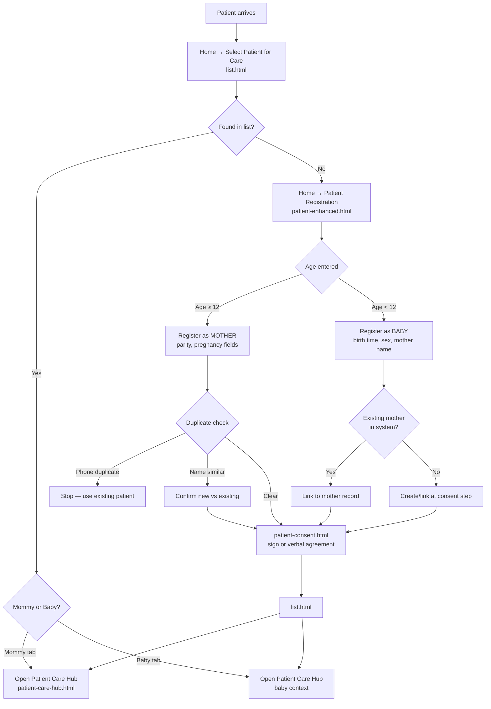
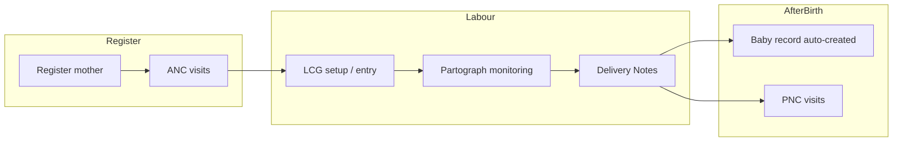
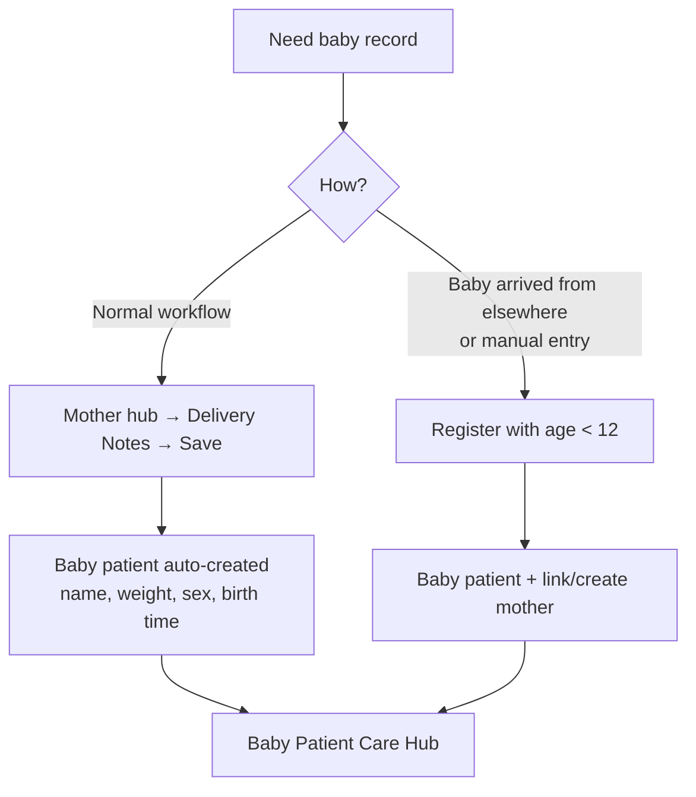
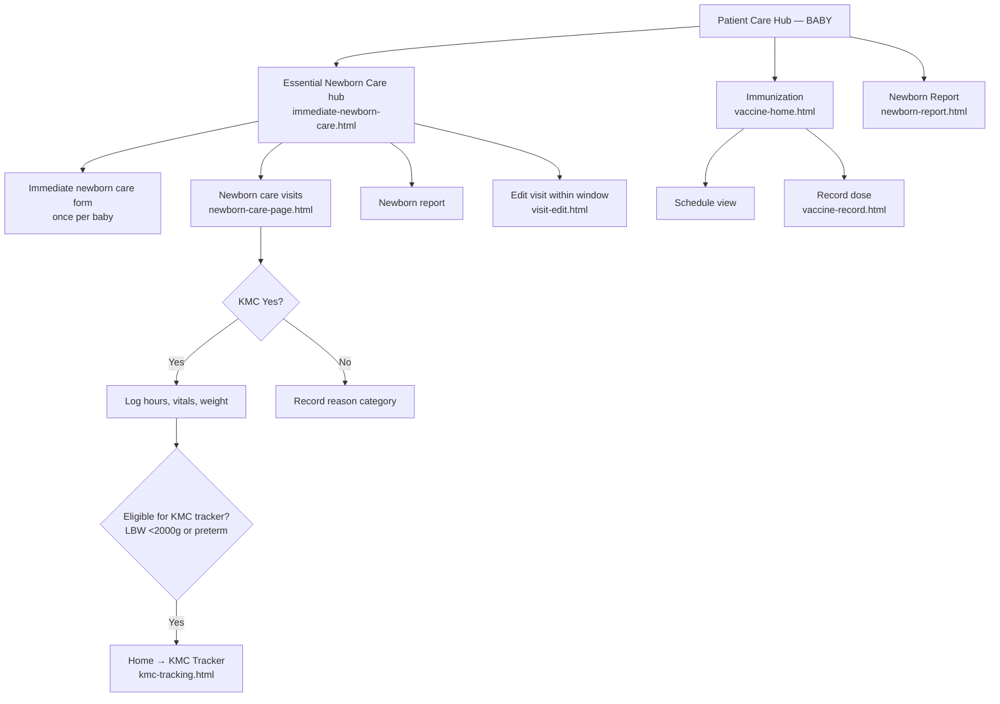
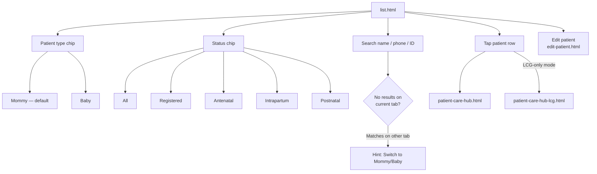
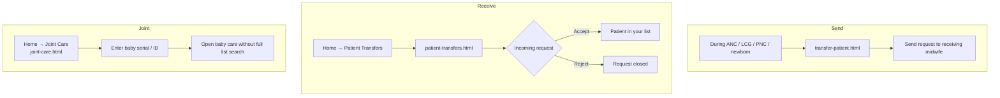
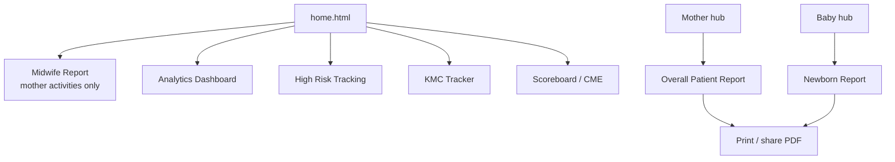
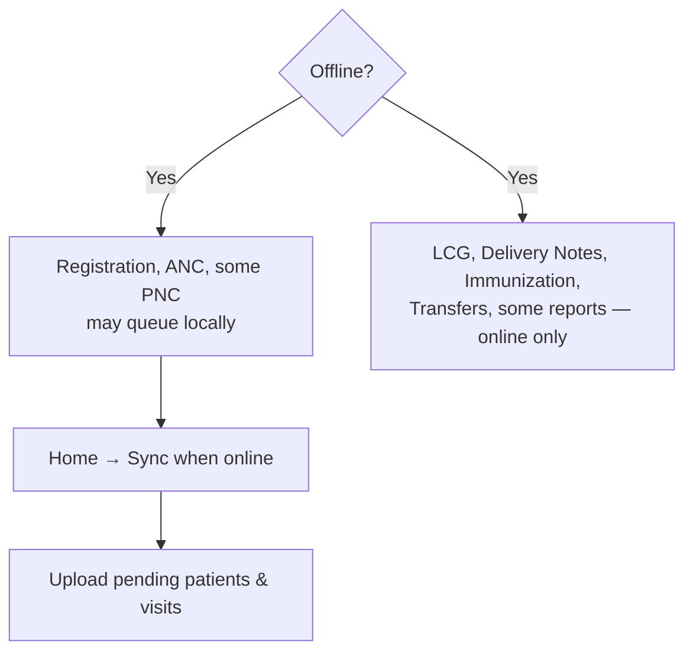

# m-MNCH Care — User Flow Diagram

**Updated:** July 2026  
**Audience:** Midwives, trainers, user-manual authors  
**Purpose:** Decision-style flowcharts for *what to do when a patient arrives* and how care modules connect.

For screen-by-screen navigation (file names), see [APP-SITEMAP.md](./APP-SITEMAP.md).

---

## 1. Session start



---

## 2. Patient incoming — new or existing?

**Always search the list first** before registering. Duplicate phone numbers are blocked; similar names show a warning.



### Quick rules

| Situation | Action |
|-----------|--------|
| Woman already in system | **Select Patient** → Mommy filter → open hub |
| Baby already in system | **Select Patient** → Baby filter → open hub |
| New pregnant woman | **Register** → age ≥ 12 → consent → hub |
| New baby (not from delivery notes) | **Register** → age &lt; 12 → mother details → consent → hub |
| Baby born during care here | **Do not register manually** — use **Delivery Notes** on mother hub (auto-creates baby) |

---

## 3. Mommy care journey (full pathway)



### From Patient Care Hub (mother selected)

```mermaid
flowchart TD
    HUB[Patient Care Hub — MOTHER]

    HUB --> ANC[Antenatal Care<br/>antenatal-care.html]
    HUB --> LAB[Labour Care]
    HUB --> DEL[Delivery Notes modal]
    HUB --> PNC[Postpartum Care<br/>postpartum-care.html]
    HUB --> REP[Overall Patient Report]

    ANC --> ANC1[Record ANC visit]
    ANC --> ANC2[Lab tests]
    ANC --> ANC3[Health education]
    ANC --> ANC4[ANC report]
    ANC1 -->|Danger / referral| TR1[transfer-patient.html]

    LAB --> LCG1{Active 1st stage<br/>time set?}
    LCG1 -->|No| SETUP[labour-care-setup.html]
    LCG1 -->|Yes| ENTRY[labour-care-entry.html]
    SETUP --> ENTRY
    ENTRY --> SUM[summary.html — Classic LCG chart]
    LAB --> CAR[Carousel LCG path<br/>setup → entry]

    DEL --> AUTO[Auto-create BABY patient(s)<br/>linked to mother]
    AUTO --> BABLIST[Visible on list — Baby filter]

    PNC --> PNC1[Record PNC visit]
    PNC --> PNC2[PNC report]

    REP --> OVER[overall-patient-report.html<br/>ANC + labour + PNC + newborn summary]
```

### Care stage vs list status

| Stage in app | Typical list status |
|--------------|---------------------|
| Registered, no ANC yet | Registered |
| ANC in progress | Antenatal |
| In labour / LCG active | Intrapartum |
| Delivered / PNC / newborn | Postnatal |

---

## 4. Baby care journey

Babies exist as **first-class patients** (`patient_type: baby`), linked to mother via `mother_patient_id`.

### How a baby record is created



### From Patient Care Hub (baby selected)

Mother-only cards (ANC, Labour, PNC) are **hidden**. Baby cards are shown.



---

## 5. Select patient list behaviour



---

## 6. Transfers & joint care



---

## 7. Reports & follow-up modules



| Report | Patient type | Shows |
|--------|--------------|-------|
| Overall Patient Report | Mother | ANC, labour, PNC, newborn summary |
| Newborn Report | Baby | Birth details, visits, immunization |
| Midwife Report | — | Mother-side visits (no baby rows) |
| ANC / PNC report | Mother | Module-specific history |

---

## 8. Offline & sync (high level)



---

## 9. One-page “midwife at the door” cheat sheet

```
Patient arrives
    │
    ├─ Know them already? ──YES──► Select Patient → search → open hub
    │
    └─ New? ──► Register
              │
              ├─ Pregnant woman (age ≥ 12) ──► mother form → consent → ANC path
              │
              └─ Baby (age < 12) ──► baby form + mother link → consent → newborn path
                                         │
                                         └─ Prefer: mother Delivery Notes instead (auto baby)

Mother hub pathway
    Register → ANC → Labour (LCG) → Delivery Notes → PNC
                              │
                              └─ creates linked baby record(s)

Baby hub pathway
    Essential Newborn (immediate + visits) → Immunization → Newborn report
                              │
                              └─ KMC tracker if LBW / preterm criteria met

Emergency / referral anytime
    Transfer patient  OR  Joint care (baby serial lookup)
```

---

## 10. Related docs

| Document | Use for |
|----------|---------|
| [APP-SITEMAP.md](./APP-SITEMAP.md) | Screen file names and navigation map |
| [MIDWIFE-USER-MANUAL.md](./MIDWIFE-USER-MANUAL.md) | Step-by-step training text |
| [user-manual-assets/README.md](./user-manual-assets/README.md) | Screenshot filenames for manual |

---

## Notes (current app behaviour)

- **Delivery Notes → auto baby** is the intended workflow after birth; manual baby registration is for babies not born through this facility’s delivery record.
- **Mommy / Baby** are separate list filters; search can hint when matches exist on the other tab.
- **Baby registration** (age &lt; 12) links to an existing mother when found; otherwise a minimal mother link is created at consent.
- **Patient Care Hub** shows different cards for mother vs baby (`data-care-audience`).
- **KMC Tracker** lists babies meeting low-birth-weight / preterm rules, not every baby with KMC Yes on a visit.
